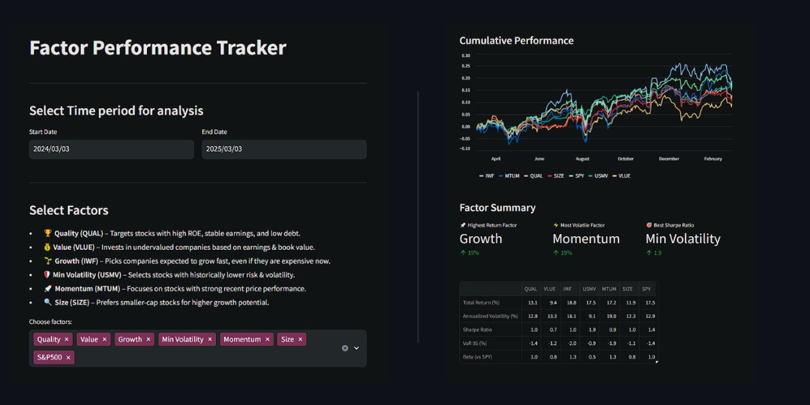

# Factor Performance Tracker
*First Finance streamlit app*



### This app tracks various factors in the US markets

You can select the date range and factors to analyze <br/>
- Performance: It will display the time series of their performances (annualized returns)
- Factor Summary: Displaying the summary of total returns, annualized volatility, Sharpe ratio
- Factor Correlation and other metrics

#### Check out the app @ [streamlit.app](https://app-fin1-hawpmehbdhznzv4ojicjz7.streamlit.app/)

# 

##### In order to run certain libraries, install them in the project folder with: <br/>
```cmd
pip install -r requirements.txt
```
<BR/><BR/>

###### [LinkedIn](https://www.linkedin.com/in/sujay-bhaumik-d12/) | s1dewalker23@gmail.com | [Research Works](https://github.com/s1dewalker/Research-Works)
